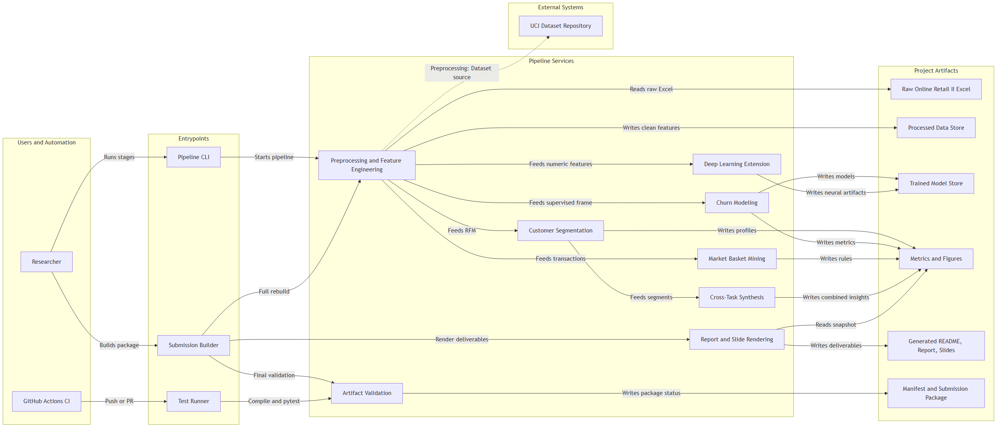

# Multi-Faceted Customer Intelligence for E-commerce
### Data Mining 2026 — Final Project (Team 4)

End-to-end data mining pipeline on the **Online Retail II** dataset combining:
1. **Preprocessing & EDA** — cleaning, RFM + behavioural feature engineering
2. **Clustering** — customer segmentation (K-means, DBSCAN, AGNES) + stability
3. **Classification** — churn prediction (6 classical models + MLP), with honest baselines, ablation & calibration
4. **Association Rules** — market basket analysis (Apriori, FP-Growth) + per-segment rules
5. **Deep Learning Extension** — Autoencoder for anomaly detection + SHAP on RF *and* MLP
6. **Cross-Task Synthesis** — basket patterns per cluster, churn rate per segment

Built **leakage-free**, **fully reproducible** (one-command pipeline, fixed seed, manifest), **tested** (34 pytest cases) and **CI-checked**.

---

## Headline Results

| Task | Result |
|------|--------|
| Cleaning | 1,067,371 → **805,549** rows · **5,878** customers · 41 countries |
| Churn labelling | cutoff `2011-09-01`, 90-day window · **5,249** labelled · 57.3% churn |
| Clustering | K-means **k=2** · silhouette **0.419** (std **0.000** over 10 seeds) · DBSCAN fails (−0.12) |
| Classification | best **LogisticRegression** test AUC **0.785** (CV 0.799) · MLP **0.783** |
| Baselines | majority **0.50** · recency-only **0.75** · without-Recency **0.75** → model adds real signal |
| Calibration | Brier **0.189**, reliability curve hugs the diagonal |
| Association | 242 itemsets · **17 rules** (lift ≥ 1.5) · top lift **26.8** · FP-Growth ~1.4× faster than Apriori |
| **Synthesis** | **67.3-pt churn gap** between segments (dormant ~90% vs active ~23%) |
| Anomaly detection | autoencoder flags top **5%** (263 customers) by reconstruction error |
| Business decisions | **5,249** customers actioned · **1,620** retention · **1,154** cross-sell · **61** manual review |

*All numbers are regenerated by the pipeline and recorded in `reports/manifest.json`.*

---

## Quick Start (one-command reproduction)

```bash
# 1. Clone the team repository, then create a venv & install dependencies
python -m venv .venv
.venv\Scripts\activate          # Windows
# source .venv/bin/activate     # macOS/Linux
pip install -r requirements.txt

# 2. Download dataset (manual step — see "Dataset" below)
#    Place online_retail_II.xlsx in data/raw/

# 3. Run the whole pipeline end-to-end (regenerates every CSV/model/figure-data)
python scripts/run_pipeline.py --stage all

# 4. Validate that all artifacts are present, schema-correct & leakage-free
python scripts/validate_artifacts.py

# 5. (optional) Run the test suite (synthetic data — no dataset required)
python -m pytest -q

# 6. (optional) Rebuild the slide deck and open the notebooks for figures/narrative
python -m src.build_slides
jupyter lab
```

> CI (`.github/workflows/ci.yml`) runs `compileall` + `pytest` on every push/PR, so the synthetic-data test suite is verified automatically without the 45 MB dataset.

**Per-stage runs** (each reads/writes only its own artifacts):

```bash
python scripts/run_pipeline.py --stage preprocess      # clean + RFM + churn labels
python scripts/run_pipeline.py --stage clustering      # K-means k=2 + stability
python scripts/run_pipeline.py --stage classification  # 6 models + MLP + baselines/ablation/calibration
python scripts/run_pipeline.py --stage association     # Apriori vs FP-Growth + top rules
python scripts/run_pipeline.py --stage deep-learning   # autoencoder anomaly detection
python scripts/run_pipeline.py --stage cross-analysis  # churn rate per segment
python scripts/run_pipeline.py --stage slides          # build reports/slides.pptx
```

**Before submitting** — one command does a clean rebuild of all artifacts,
re-renders the report/README/slides from the resulting metrics, validates
everything, and writes `reports/submission_manifest.json`:

```bash
python scripts/build_submission_package.py
```

> The report (`overleaf/main.tex`) and README headline are **generated** from
> the metrics snapshot (`src/submission_snapshot.py`) via
> `python -m src.report_renderer` / `-m src.readme_renderer`, so numbers can
> never drift from the pipeline. Edit prose in `overleaf/main.template.tex` /
> `README.template.md`, never the generated files. Exporting `slides.pdf` and
> `ieee_report.pdf` remains a manual step.

---

## Dataset

**Online Retail II** — UCI Machine Learning Repository (ID 502)

- Download URL: https://archive.ics.uci.edu/dataset/502/online+retail+ii
- File to place at `data/raw/online_retail_II.xlsx` (~45 MB)
- A processed-data mirror (parquet/CSV) can be shared via the team Google Drive so graders can skip the 45 MB download and start from `--stage classification` onward.

---

## Architecture Diagram



Four layers, data flowing left → right: **users & automation** (researcher, CI) →
**entry points** (`run_pipeline.py`, `build_submission_package.py`, `pytest`) →
**pipeline services** (preprocessing, segmentation, churn modeling, market-basket
mining, deep learning, cross-task synthesis, report/slide rendering, artifact
validation) → **artifact stores** (processed data, trained models, metrics/figures,
generated report/slides/README, submission manifest).

The diagram is the project's own architecture, rendered from the Mermaid source in
[`docs/architecture.md`](docs/architecture.md) (also available as an editable
[FigJam board](https://www.figma.com/board/OZvN3QYqAACLRatPzaeL2W?utm_source=other&utm_content=edit_in_figjam&oai_id=&request_id=371248dc-310e-448f-9fad-ceb4f1490599&architecture=true)).

---

## Repository Structure

```
.
├── README.md                  # this file
├── requirements.txt
├── pytest.ini
├── .gitignore
├── .github/workflows/ci.yml   # compileall + pytest on push/PR
├── data/
│   ├── raw/                   # online_retail_II.xlsx (NOT committed)
│   └── processed/             # transactions_clean.parquet, rfm_features.csv,
│                              # churn_labels.csv, classification_features.csv,
│                              # segments_*.csv, splits.joblib, anomalous_customers.csv
├── notebooks/                 # run in numeric order (presentation/figures layer)
│   ├── 01_eda.ipynb
│   ├── 02_clustering.ipynb
│   ├── 03_classification_classical.ipynb
│   ├── 04_association_rules.ipynb
│   ├── 05_deep_learning.ipynb         # MLP + autoencoder + SHAP (RF & MLP)
│   └── 06_cross_analysis.ipynb
├── src/                       # importable Python modules (all business logic)
│   ├── utils.py               # seed_all(42), paths, savefig, get_logger
│   ├── plot_style.py          # shared matplotlib rcParams
│   ├── preprocessing.py       # clean, make_rfm, label_churn, make_classification_features
│   ├── features.py            # build_supervised_frame, make_preprocessor (leakage-safe)
│   ├── clustering.py          # K-means, DBSCAN, AGNES + validation + stability
│   ├── classification.py      # 6 classical + MLP + autoencoder + mlp_proba_fn (SHAP)
│   ├── evaluation.py          # baselines, ablation, calibration
│   ├── association.py         # Apriori, FP-Growth, popularity filter, per-cluster rules
│   ├── artifacts.py           # canonical paths, schemas, manifest read/write
│   └── build_slides.py        # generate reports/slides.pptx (20 slides)
├── scripts/
│   ├── run_pipeline.py        # one-command staged pipeline runner
│   ├── validate_artifacts.py  # submission-grade consistency/leakage checks
│   └── rebuild_classification_features.py  # leakage sanity check (old vs new AUC)
├── tests/                     # pytest suite (34 cases, synthetic data, <20 s)
│   ├── conftest.py            # synthetic fixtures
│   ├── test_preprocessing.py  # cleaning + leakage-safe labelling
│   ├── test_features.py       # supervised frame + unseen-country encoding
│   ├── test_classification.py # 6-model smoke + pipeline order + MLP wrapper
│   ├── test_association.py    # rule mining + popularity filter + skip reasons
│   └── test_artifacts.py      # schema/consistency (skips if pipeline not run)
├── docs/
│   ├── architecture.md        # FigJam architecture link + Mermaid source
│   └── qa_defense.md          # oral defense answers grounded in artifacts
├── models/                    # trained *.joblib + mlp.pt / autoencoder.pt (NOT committed)
├── reports/
│   ├── figures/                  # 300 dpi PNGs (incl. 05_shap_*, 03_ablation, 03_calibration)
│   ├── classical_results.csv     # 6-model leaderboard
│   ├── baseline_results.csv      # honest baselines
│   ├── ablation_results.csv      # feature-group ablation
│   ├── calibration_results.csv   # reliability curve + Brier
│   ├── cluster_stability.csv     # multi-seed K-means stability
│   ├── clustering_validation.csv # K-means/DBSCAN/AGNES validation indices
│   ├── cluster_profile_kmeans.csv
│   ├── association_rules.csv     # top rules with descriptions
│   ├── apriori_vs_fpgrowth.csv   # itemset counts + runtime comparison
│   ├── mlp_vs_classical.csv      # DL vs best classical
│   ├── churn_by_cluster.csv      # cross-task synthesis
│   ├── manifest.json             # seed, cutoff, row counts, metrics, versions
│   ├── ieee_report.pdf           # final PDF
│   └── slides.pptx / slides.pdf
└── overleaf/                  # IEEE LaTeX source
```

---

## Team & Workstreams

**Team 4 — University of Information Technology, VNU-HCM**

| Member | Student ID | Responsibility | Files |
|--------|-----------|----------------|-------|
| Nguyen Minh Cuong | 22520177 | EDA & clustering | `01_eda.ipynb`, `02_clustering.ipynb`; `src/clustering.py` |
| Vo Thanh Danh | 22520201 | Core pipeline & shared modeling code | `src/preprocessing.py`, `src/features.py`, `src/classification.py`, `src/evaluation.py`, `src/decision_layer.py`, `src/artifacts.py`; `scripts/run_pipeline.py`, `scripts/validate_artifacts.py`; tests + CI |
| Nguyen Vinh Dat | 22520228 | Classification & deep learning notebooks | `03_classification_classical.ipynb`, `05_deep_learning.ipynb` |
| Nguyen Huu Dinh | 22520251 | Association rules, cross-analysis & reporting | `04_association_rules.ipynb`, `06_cross_analysis.ipynb`; `src/association.py`; report + slides |

*Responsibilities can be swapped to match team preferences.*

---

## Reproducibility & Methodology

- All randomness seeded with `42` via `src.utils.seed_all(42)`; versions pinned in `requirements.txt`
- **No target leakage:** churn features are built *only* from transactions strictly before the cutoff `2011-09-01`; the label is "no purchase in the following 90 days". Country encoding (`OneHotEncoder`, rare-folded) lives inside the CV pipeline, so it is fit on training folds only.
- **Honest evaluation:** the best AUC (~0.78) is benchmarked against majority-class / recency-only baselines, an ablation over feature groups, and a probability-calibration check (Brier + reliability curve).
- **Explainability:** SHAP on both the RandomForest (`TreeExplainer`) and the MLP (`KernelExplainer`) confirm Recency + behavioural features as the churn drivers, in agreement across models.
- **Provenance:** `reports/manifest.json` records the seed, cutoff, row counts, headline metrics, Python and package versions for the run that produced the artifacts.
- **Logging:** library code uses a configurable logger (`src.utils.get_logger`) instead of bare `print`.

---

## Testing, Validation & CI

```bash
python -m pytest -q                       # 34 tests, synthetic data, <20 s
python scripts/validate_artifacts.py      # 19 submission-grade checks on real artifacts
python scripts/rebuild_classification_features.py   # leakage sanity: old (leaky) vs new AUC
```

- **`tests/`** — unit tests for cleaning, leakage-safe labelling, the encoding pipeline (incl. unseen-country handling), a 6-model classification smoke test, association mining, and artifact schemas. Runs on synthetic data, so it needs no dataset; torch-dependent tests skip automatically.
- **`validate_artifacts.py`** — checks every CSV is present, schema-correct, mutually consistent (feature/label customer sets match), leakage-free (Recency ≥ 0, best AUC in a realistic range), placeholder-free, and that the deck has 20 slides. Exit code 0 = ready to submit.
- **CI** — `.github/workflows/ci.yml` runs `compileall` + `pytest` on every push and pull request.


## License

For academic use only — Data Mining 2026.
