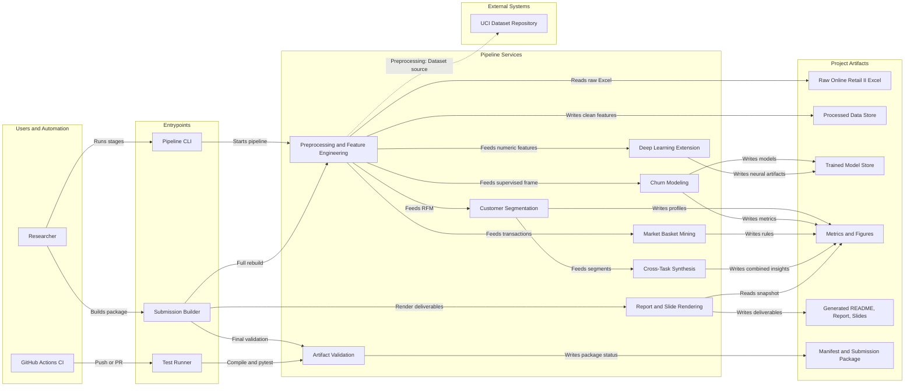

# Architecture Diagram

Editable FigJam diagram: [Data Mining Pipeline Architecture](https://www.figma.com/board/OZvN3QYqAACLRatPzaeL2W?utm_source=other&utm_content=edit_in_figjam&oai_id=&request_id=371248dc-310e-448f-9fad-ceb4f1490599&architecture=true)


*Static render at `reports/figures/00_architecture.png`, used by the slide deck and
the IEEE report (which cannot display Mermaid). It is rendered directly from the
Mermaid source below via mermaid-cli — requires Node.js:*

```bash
npx -y @mermaid-js/mermaid-cli -i docs/architecture.md -o reports/figures/00_architecture.png -b white -w 2600
```

*The editable sources are the FigJam board above and the Mermaid flowchart below.*

This diagram documents the repository-level architecture for the data mining
project. It focuses on the executable pipeline, generated artifacts, report
rendering, and validation flow. Diagram labels are intentionally written in
English so the FigJam board is presentation-ready.

Update this Mermaid source first when the architecture changes, then regenerate
the FigJam diagram from the same source.


